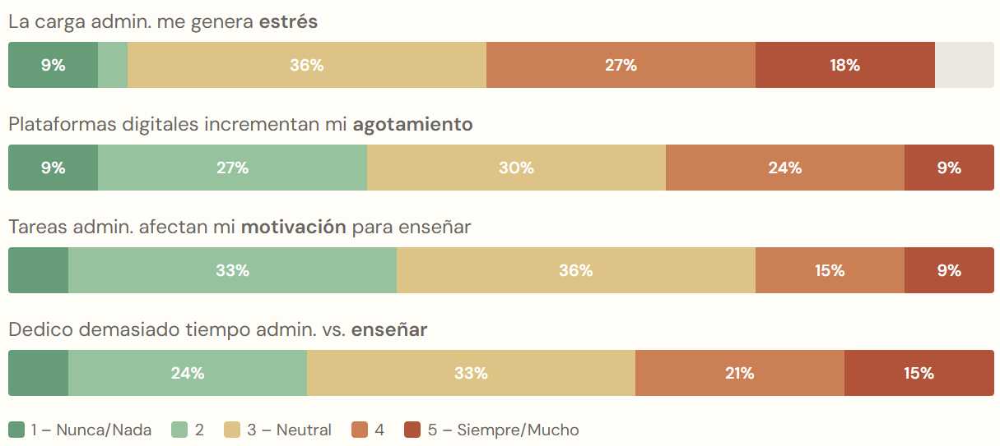
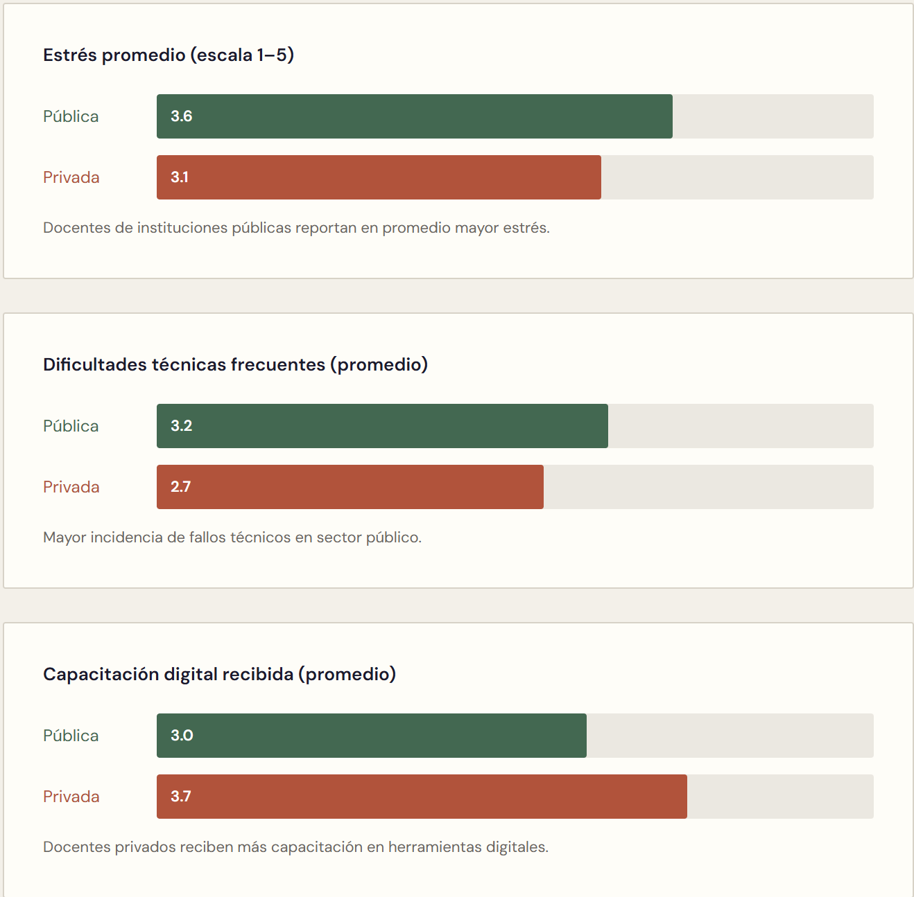

# Matriz Problema → Solución — TIZA

> *"Los docentes colombianos dedican hasta 40% de su tiempo a tareas administrativas en lugar de enseñar."*

---

## Contexto

El sistema educativo colombiano opera mayoritariamente con planeaciones en Word, asistencia en papel, notas en Excel y boletines digitados manualmente. El docente promedio gestiona entre 3 y 6 grupos con 30–45 estudiantes cada uno, lo que genera una carga administrativa que compite directamente con el tiempo de preparación pedagógica.

### Evidencia de la investigación

Los siguientes gráficos provienen de la encuesta inicial aplicada a 23 docentes colombianos (método: Google Forms, análisis mixto cuanti-cuali). Las imágenes se encuentran en [`../Figures/`](../Figures/).

*Gráfica: distribución del nivel de estrés reportado por docentes encuestados.*

*Gráfica: carga administrativa comparada entre sector público y privado.*

*Matriz de priorización de soluciones por impacto y factibilidad.*

---

## Matriz Problema → Solución → Evidencia

| # | Problema | Causa raíz | Solución TIZA | Evidencia / Validación |
|---|----------|------------|--------------|----------------------|
| P-01 | Planeación de clases toma 2–4 h por sesión | No hay punto de partida estructurado; el docente parte de cero cada vez | Generación de esquema con IA (Gemini) en < 30 s a partir del objetivo curricular seleccionado | HU-13, RF-13 · módulo `Planning.tsx` |
| P-02 | El registro de asistencia se hace en papel y se pierde | No existe herramienta digital simple; las plataformas existentes son complejas | Lista precargada con marcado de presencia/ausencia en un toque por estudiante | HU-17, RF-17 · módulo `Attendance.tsx` |
| P-03 | El cálculo de promedios es manual y propenso a errores | Excel requiere conocimiento técnico y cada docente usa una fórmula diferente | Ingreso de notas por tipo de evaluación con cálculo automático ponderado | HU-19, RF-19 |
| P-04 | Los boletines e informes toman días de trabajo | Cada comentario cualitativo se redacta desde cero; el docente repite información que ya registró | Generación automática de borradores de comentarios cualitativos con IA en < 45 s por grupo | HU-24, RF-24 |
| P-05 | Conectividad a internet es intermitente en muchas sedes | Colegios públicos y zonas rurales con señal inestable | Cola offline en IndexedDB + sincronización automática al recuperar señal | HU-22, RF-22 · `offlineQueue.ts` |
| P-06 | No hay visibilidad del estado del trabajo pedagógico semanal | La información está dispersa en múltiples documentos y carpetas | Panel centralizado con pendientes diarios, planeaciones por clase y calendario semanal | HU-28, RF-28 · `Dashboard.tsx` |
| P-07 | La importación de listas de estudiantes es un proceso manual lento | Los listados llegan en Excel desde la secretaría y hay que digitarlos | Importación CSV/Excel con previsualización, deduplicación y manejo de errores por fila | HU-07, RF-07 · `Students.tsx` |
| P-08 | Los docentes no tienen visibilidad sobre planeaciones aprobadas o rechazadas | El coordinador revisa en papel o por WhatsApp, sin trazabilidad | Flujo de revisión coordinador→docente con estados `pending_review`, `approved`, `rejected` | `CoordinatorDashboard.tsx` |
| P-09 | No existe canal formal para reportar fallas a los administradores | Los errores se reportan por WhatsApp o se ignoran | Botón "Reportar" en todas las pantallas → tabla `bug_reports` en Supabase | `BugReportModal.tsx` |

---

## Alcance del MVP (Piloto 2 meses)

Los problemas **P-01, P-02, P-03, P-05 y P-06** son los de mayor impacto y están completamente implementados en el MVP. P-04, P-07 y P-08 están implementados pero en validación. P-09 es infraestructura operativa.

---

*TIZA · Matriz Problema-Solución · v1.0 · 2026*