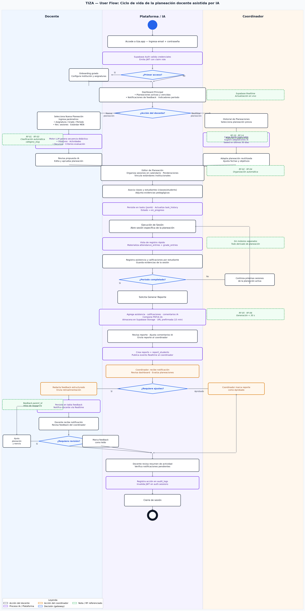

# Diagrama de Navegación — TIZA

> **Diagrama visual:** El flujo de usuario completo (10 pasos, perspectiva del docente principal) está disponible como imagen en [`../../Figures/tiza_userflow.png`](../../Figures/tiza_userflow.png). Los diagramas ASCII a continuación son la representación textual del mismo flujo.



---

## Flujo general por rol

```
                        ┌─────────────────────┐
                        │   tiza.vercel.app/   │
                        └──────────┬──────────┘
                                   │
                    ┌──────────────▼──────────────┐
                    │        RootRedirect          │
                    │  (lee perfil + rol en BD)    │
                    └──┬──────────┬──────────┬────┘
                       │          │          │
               No auth │    role= │    role= │ role=
                       │  teacher │coordinator│ admin
                       ▼          ▼          ▼
                   /login    /dashboard  /coordinator  /admin
```

---

## Flujo completo — Docente (teacher)

```
/login ──► / ──► /dashboard
                     │
          ┌──────────┼──────────────┐
          │          │              │
          ▼          ▼              ▼
     /planning   /my-plans      /classes
          │          │              │
          │     (ver, editar,   ┌───┴───────────────┐
          │      exportar,      │                   │
          │      enviar a       ▼                   ▼
          │      revisión)  /classes/:id        /classes/:id
          │                  /students           /attendance
          ▼                    │
   (genera 3 ideas           (agregar manual,
    con Gemini)               importar CSV,
          │                   desmatricular)
    (selecciona,
     edita,
     guarda)
          │
    /my-plans
```

---

## Flujo completo — Coordinador (coordinator)

```
/login ──► / ──► /coordinator
                     │
              (ve planeaciones
               pending_review
               de su institución)
                     │
              (aprueba o rechaza
               con comentario)
                     │
              (docente recibe
               estado actualizado
               en /my-plans)
```

---

## Flujo completo — Administrador (admin)

```
/login ──► / ──► /admin
                   │
          (crea instituciones
           educativas: nombre,
           tipo, ciudad, país)
                   │
          (genera códigos de
           invitación por
           institución)
                   │
          (coordinadores y docentes
           usan el código en
           /register para unirse
           a la institución)
```

---

## Flujo de registro

```
/register
    │
    ├── ingresa: nombre, email, contraseña
    ├── selecciona rol: teacher | coordinator
    ├── (opcional) código de invitación institucional
    └── acepta política de datos (Ley 1581)
         │
         ▼
    Supabase Auth crea usuario
         │
         ▼
    trigger handle_new_user()
    crea registro en app_users
         │
         ▼
    / ──► RootRedirect ──► dashboard según rol
```

---

## Flujo offline

```
Docente sin internet
         │
         ▼
    Registra asistencia / notas
         │
         ▼
    offlineQueue.ts
    almacena en IndexedDB
    (tipo: UPSERT_ATTENDANCE)
         │
    [sin internet...]
         │
    window 'online' event
         │
         ▼
    drainQueue()
    reproduce acciones
    en Supabase
         │
         ▼
    Banner verde: "Sincronizado"
```

---

## Mapa de rutas

| Ruta | Componente | Rol requerido |
|------|-----------|---------------|
| `/login` | `Login.tsx` | Público |
| `/register` | `Register.tsx` | Público |
| `/` | `RootRedirect.tsx` | Autenticado |
| `/dashboard` | `Dashboard.tsx` | `teacher` |
| `/planning` | `Planning.tsx` | `teacher` |
| `/my-plans` | `MyPlans.tsx` | `teacher` |
| `/classes` | `Classes.tsx` | `teacher` |
| `/classes/:id/students` | `Students.tsx` | `teacher` |
| `/classes/:id/attendance` | `Attendance.tsx` | `teacher` |
| `/coordinator` | `CoordinatorDashboard.tsx` | `coordinator` |
| `/admin` | `AdminDashboard.tsx` | `admin` |
| `/account` | `Account.tsx` | Cualquier autenticado |

---

*TIZA · Diagrama de Navegación · v1.0 · 2026*