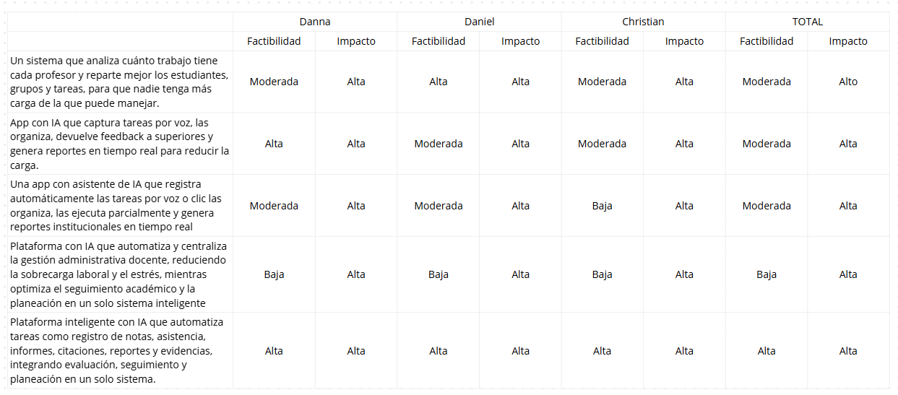

# Figures — Imágenes del documento académico TIZA

Este directorio contiene las imágenes referenciadas en el documento académico principal del proyecto (`TIZA_IEEE_Document.tex`). Los nombres de archivo deben mantenerse exactamente como aparecen aquí para que las referencias LaTeX (`\includegraphics{Figures/...}`) sigan funcionando.

---

## Imágenes requeridas

| Archivo | Descripción | Sección del documento |
|---------|-------------|----------------------|
| `estres.png` | Gráfica de distribución: nivel de estrés docente (encuesta) | Investigación — resultados cualitativos |
| `comparacion.png` | Comparación colegio público vs privado en carga administrativa | Investigación — análisis comparativo |
| `matriz_impacto.png` | Matriz impacto–factibilidad de las soluciones propuestas | Definición del producto — priorización |
| `tiza_userflow.png` | Diagrama de flujo de usuario (10 pasos, docente principal) | Diseño — flujo de navegación |
| `wireframe_login.jpeg` | Prototipo de pantalla de login / registro | Diseño — wireframes de baja fidelidad |
| `wireframe_dashboard.jpeg` | Prototipo de panel principal del docente | Diseño — wireframes de baja fidelidad |
| `wireframe_planeacion.jpeg` | Prototipo del editor de planeación con IA | Diseño — wireframes de baja fidelidad |

---

## Cómo agregar las imágenes

1. Coloca cada imagen en este directorio con el nombre exacto de la tabla anterior.
2. No cambies la extensión (`.png` / `.jpeg`) — el LaTeX referencia los nombres tal como están.
3. Haz commit de las imágenes junto con cualquier actualización del documento.

```bash
git add docs/Figures/
git commit -m "docs: add figures for academic document"
```

---

## Relación con la documentación del repositorio

Las mismas imágenes también pueden referenciarse desde los archivos Markdown del repositorio:

```markdown


```

---

*TIZA · Figures · Documento académico · 2026*